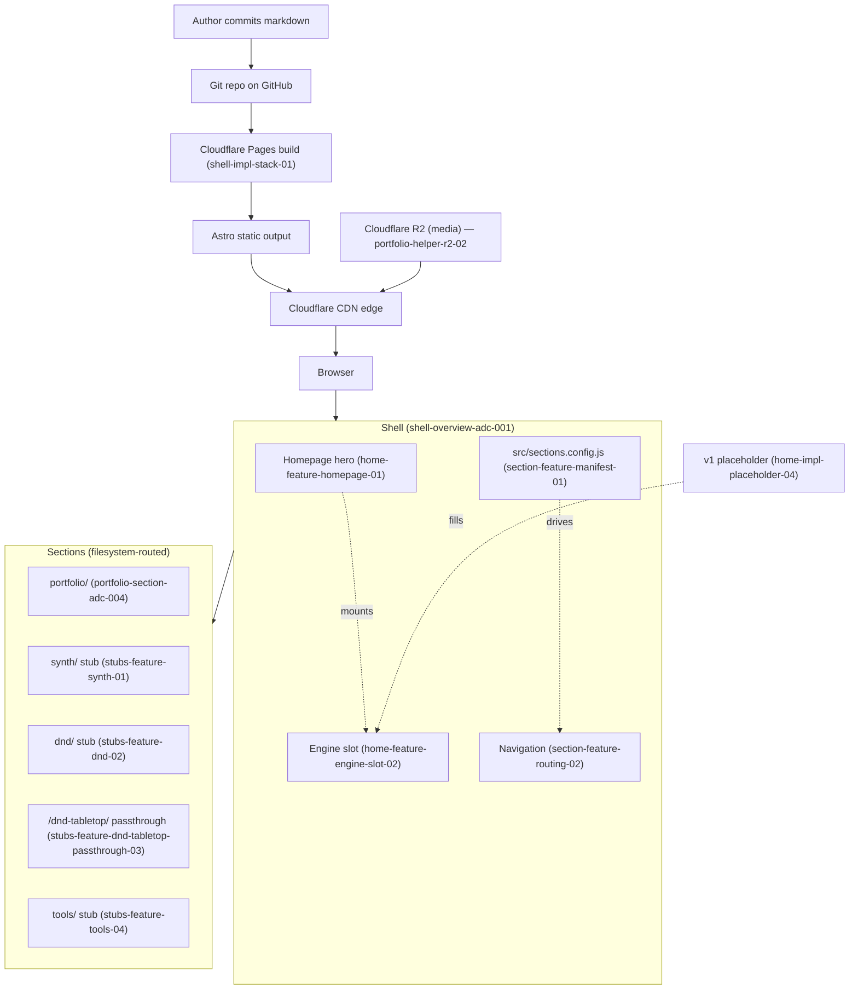

# Shell Overview

This contract is the root of the `milodowling.com` shell redesign. It encodes the
project rationale, the federation principle, the stack and deployment story, the
shell architecture, and the four cross-cutting constraints (aesthetic federation,
modularity, mobile-renders, URL preservation) along with their test scenarios.

Section internals (synth, D&D, tools, the WebGL engine) are deferred to their own
ADC sessions. This contract anticipates them as mount points only.

---

### [Rationale: Why this shell exists] <shell-rationale-01>

`milodowling.com` is a personal-site shell — a playground frame that hosts several
first-class sections, each of which can evolve independently. The previous Hugo
site is being discarded except for a single preserved D&D tool (see
`<shell-constraint-url-preservation-04>`).

**Federation principle (load-bearing).** The shell carries its own identity
(anchor references: `remix.run` + video-synthesis aesthetics — dark, type-forward,
technical, with visual energy in the hero). Each section is free to set its own
aesthetic anchor when *that section* is designed (synth's eventual anchor is
`gieskes.nl`; others TBD). The shell must remain aesthetically permissive —
section styles must not leak into the shell or into other sections, and the shell
must not leak into sections.

**Owner-update load-bearing constraint.** The whole structure exists to make the
site easy for the owner to update. If the modular section pattern, the deploy
flow, or the content authoring story makes updates feel like friction, the design
has failed. Modularity, low-ceremony content addition, and a deploy path that
"just works" trump elegance or completeness.

**Forward-compatibility load-bearing constraint.** The shell must never lock out a
future section by prescribing too much. Synth, D&D, tools, and the engine each
get their own design passes. The shell anticipates them as *mount points*, not as
defined subsystems.

---

### [Implementation: Stack and deployment] <shell-impl-stack-01>

The shell is built on:

- **Framework:** Astro with React islands. JavaScript by default; TypeScript
  permitted but not required. The owner is learning React, so the React surface
  area is concentrated in islands (engine slot, interactive components) rather
  than full-page React.
- **Hosting:** Cloudflare Pages for build and deploy.
- **Media:** Cloudflare R2 for portfolio and section media. The shell exposes a
  single helper for resolving R2 URLs from authoring code (see
  `<portfolio-helper-r2-02>` in `ADC_004_PORTFOLIO_SECTION.md`).
- **Domain:** `milodowling.com` is the target; `milodowling.github.io` is the
  fallback and currently-live domain. Both must serve the same build.
- **Source-of-truth content authoring:** v1 is repo commits — markdown files
  committed to the repository, deployed via push-to-build on Cloudflare Pages.
  No CMS in v1. Friction beyond commits is deferred to future passes.

The shell does not prescribe per-section build pipelines beyond what Astro's
default site generation provides. Sections that need more (e.g., a future
synth section with dynamic data) negotiate that in their own ADC pass.

**Documentation artifacts.** The stack ships with a top-level `README.md` that
includes the "add-a-section" procedure referenced by
`<shell-test-modularity-02>` (the two-file-touch procedure: a new
`src/pages/<section>/` directory and one entry in `src/sections.config.js`).
This documentation is part of the stack contract, not a side artifact — the
modularity test relies on the procedure being discoverable from the repo root.

**Parity:**
- **Implementation Scope:** repo root, `astro.config.mjs`, `package.json`, Cloudflare Pages dashboard configuration, `README.md` (add-a-section procedure)
- **Configuration Scope:** `astro.config.mjs`, `wrangler.toml` (if used for R2 binding), `.env.example`
- **Tests:**
  - `tests/shell/build.spec.js` — verifies clean build
  - `tests/shell/deploy-smoke.spec.js` — verifies deployed routes return 200

---

### [Diagram: Shell architecture] <shell-diagram-architecture-01>

Node identifiers below use ADC block IDs (with angle brackets stripped) where a
node maps to a defined block; pipeline-stage nodes that do not map to a block
keep descriptive identifiers.

---

### [Constraint: Aesthetic federation] <shell-constraint-federation-01>

Section styles must not leak into the shell, and shell styles must not impose on
sections beyond a documented reset/baseline. The shell uses Astro's scoped styles
as the default mechanism. Section-namespaced CSS classes (any class prefixed
with a section identifier — e.g., `synth-`, `portfolio-`, `dnd-`, `tools-`) must
not appear in shell-level CSS output.

The shell publishes a minimal baseline (CSS reset, typographic defaults, a small
set of design tokens) under a documented namespace (suggested: `shell-` prefix or
`:where(.shell)` scoping). Sections may opt out of any baseline token by
re-declaring it within their own scope.

**Enforcement mechanism (locked for v1).** Federation is enforced by Astro
scoped styles plus the binding TestScenarios (`<shell-test-federation-01>` for
section → shell leakage and `<shell-test-federation-cross-section-05>` for
section → other-section leakage). No CI lint rule is required in v1. A
build-time lint rule that scans CSS output for cross-namespace leakage remains
an available upgrade path if scoped styles + tests prove insufficient in
practice; it is not part of the v1 contract.

**Parity:**
- **Implementation Scope:** `src/layouts/`, `src/styles/`, section-level styles under `src/pages/<section>/`
- **Configuration Scope:** `astro.config.mjs` (style scoping behavior)
- **Tests:**
  - See `<shell-test-federation-01>`

---

### [Constraint: Modularity — adding a section is lightweight] <shell-constraint-modularity-02>

Adding a new section to the shell must be a low-ceremony operation: drop a
directory under `src/pages/<section>/`, register it in the section manifest (see
`<section-feature-manifest-01>` in `ADC_002_SECTION_MANIFEST_AND_ROUTING.md`),
and the section appears in navigation and serves at `/<section>/`. The shell
itself does not need to be modified to add a section.

The bar is: a new section can be added by touching only (a) files under
`src/pages/<section>/` and (b) one entry in `src/sections.config.js`. No edits to
shell layouts, nav components, or routing internals are required.

**Parity:**
- **Implementation Scope:** `src/pages/`, `src/sections.config.js`
- **Tests:**
  - See `<shell-test-modularity-02>`

---

### [Constraint: Mobile renders cleanly] <shell-constraint-mobile-03>

Every shell route (homepage, portfolio index, individual portfolio entries, and
the stub pages for synth, D&D, and tools) must render without horizontal scroll
at a 375px-wide viewport. Engine-on-mobile fidelity specifics (e.g., shader
performance) are deferred to the engine pass; the shell only needs the v1
placeholder to *degrade gracefully* (no overflow, no layout breakage, no
unrecoverable visual artifacts).

**Parity:**
- **Implementation Scope:** `src/layouts/`, `src/styles/`, responsive CSS across all routes
- **Tests:**
  - See `<shell-test-mobile-03>`

---

### [Constraint: URL preservation — /dnd-tabletop/ must keep serving] <shell-constraint-url-preservation-04>

**Status: SUPERSEDED (2026-07-10) by `<dnd-feature-tool-route-01>` in
`ADC_006_DND_TABLETOP.md`** — the D&D ADC init pass this constraint
anticipated. Kept for the record; do not implement against this entry.

What carried forward, and what was retired:

- **Carried forward:** `/dnd-tabletop/` MUST keep serving the virtual-tabletop
  tool at `/dnd-tabletop/` and `/dnd-tabletop/index.html`, standalone (no
  shell layout). The URL was shared with friends and remains canonical.
- **Retired:** the byte-freeze. v1.0 of this constraint asserted content
  identity against a preserved Hugo-era copy in `_preserved-dnd-content/`
  (locked assertion: identity after HTTP decoding + line-ending
  normalization, wire-level byte-identity rejected). The 2026-07-10 pass
  absorbed the tool as first-party source at `public/dnd-tabletop/` and the
  tool now evolves; the preserved copy, the build-time passthrough, and the
  removal-marker system were removed per the (now deleted)
  `adc_files/implementation/DND_PRESERVATION_ARTIFACTS.md` procedure.

The continuity test is now `<dnd-test-url-continuity-01>`
(`tests/shell/url-preservation.e2e.js`), which asserts 200s, served-body
identity with the committed source, and standalone serving.

**Parity:**
- **Implementation Scope:** superseded — see `ADC_006_DND_TABLETOP.md`
- **Tests:**
  - `<dnd-test-url-continuity-01>` in `ADC_006_DND_TABLETOP.md`

---

### [TestScenario: Federation — section styles don't leak to shell] <shell-test-federation-01>

**Covers:** `<shell-constraint-federation-01>` (section → shell direction)

**Scenario.** Add a synthetic section `test-federation/` with a CSS rule that
sets `body { background: red; }` inside a scoped style. Build the site. Verify:

1. The synthetic section's page renders with the red background within its own
   scope.
2. The shell's homepage and other shell-owned chrome pages do NOT have a red
   background.
3. The generated CSS for the shell's homepage and shell chrome contains no
   rules whose selectors include `test-federation`-namespaced classes or the
   unscoped `body { background: red }` declaration.

This scenario covers section → shell leakage only. The companion direction
(section → other-section leakage) is covered by
`<shell-test-federation-cross-section-05>`.

**Parity:**
- **Implementation Scope:** `tests/shell/federation.spec.js`
- **Tests:**
  - `tests/shell/federation.spec.js`

---

### [TestScenario: Federation — section styles don't leak to other sections] <shell-test-federation-cross-section-05>

**Covers:** `<shell-constraint-federation-01>` (section → other-section
direction)

**Scenario.** Add two synthetic sections, `test-federation-a/` and
`test-federation-b/`. In `test-federation-a/`, declare a scoped style that
sets `body { background: red; }`. In `test-federation-b/`, declare a scoped
style that sets `body { background: blue; }`. Build the site. Verify:

1. `/test-federation-a/` renders with a red background within its own scope.
2. `/test-federation-b/` renders with a blue background within its own scope.
3. `/test-federation-a/` does NOT render with a blue background (no leakage
   from B into A).
4. `/test-federation-b/` does NOT render with a red background (no leakage
   from A into B).
5. The generated CSS for `/test-federation-a/` contains no rules sourced from
   `test-federation-b/`'s scoped styles, and vice versa.
6. As an additional spot check, verify the same property between
   `/test-federation-a/` and `/portfolio/`: the portfolio index's effective
   background is neither red nor blue.

This scenario establishes that the federation constraint holds across all
three leakage pairs (shell↔section verified by `<shell-test-federation-01>`;
section↔section verified here).

**Parity:**
- **Implementation Scope:** `tests/shell/federation-cross-section.spec.js`
- **Tests:**
  - `tests/shell/federation-cross-section.spec.js`

---

### [TestScenario: Modularity — adding a synthetic "writing" section] <shell-test-modularity-02>

**Covers:** `<shell-constraint-modularity-02>`

**Scenario.** Add a synthetic `writing` section by:

1. Creating `src/pages/writing/index.astro` with a single `<h1>Writing</h1>`.
2. Adding `{ slug: "writing", label: "Writing", enabled: true }` to
   `src/sections.config.js`.

No other files are touched. Build the site. Verify:

1. Navigation includes a "Writing" entry in the order declared by the manifest.
2. `/writing/` returns 200 and renders the `<h1>`.
3. No other section's output is affected.
4. The git diff for the change contains exactly two file edits: the new page
   file and the manifest update.

This test exercises the documented "add-a-section" procedure (which lives in
`README.md` or `CONTRIBUTING.md` — see `<shell-impl-stack-01>`).

**Parity:**
- **Implementation Scope:** `tests/shell/modularity.spec.js`, `README.md` (procedure)
- **Tests:**
  - `tests/shell/modularity.spec.js`

---

### [TestScenario: Mobile — no horizontal scroll at 375px] <shell-test-mobile-03>

**Covers:** `<shell-constraint-mobile-03>`

**Scenario.** Using a headless browser at viewport 375x812:

1. Load `/` (homepage). Verify `document.documentElement.scrollWidth <= 375`.
2. Load `/portfolio/`. Same assertion.
3. Load each portfolio entry route. Same assertion.
4. Load `/synth/`, `/dnd/`, `/tools/` (stub pages). Same assertion.
5. Load `/dnd-tabletop/` (preserved tool). The preserved tool is NOT bound by
   the 375px constraint (it predates the shell); this route is exempt and the
   test must explicitly skip it with a comment referencing this contract.

The engine-slot placeholder must not cause overflow on mobile. Engine fidelity
on mobile (e.g., framerate, resolution) is out of scope for this constraint;
those gates live in the engine pass.

**Parity:**
- **Implementation Scope:** `tests/shell/mobile.spec.js`
- **Tests:**
  - `tests/shell/mobile.spec.js`

---

### [TestScenario: URL preservation — /dnd-tabletop/ serves the preserved tool] <shell-test-url-preservation-04>

**Status: SUPERSEDED (2026-07-10) by `<dnd-test-url-continuity-01>` in
`ADC_006_DND_TABLETOP.md`**, alongside its constraint
`<shell-constraint-url-preservation-04>`. The v1.0 scenario asserted
content identity between the served body and the preserved Hugo-era copy in
`_preserved-dnd-content/` (after HTTP decoding + CRLF→LF normalization).
That freeze ended when the D&D pass absorbed the tool as first-party source;
the successor test keeps the 200/standalone/served-equals-committed-source
assertions and adds an app-boot check. Same test file
(`tests/shell/url-preservation.e2e.js`), rewritten under the new id.

**Parity:**
- **Tests:**
  - `<dnd-test-url-continuity-01>` → `tests/shell/url-preservation.e2e.js`

---

### [Reference: Section mount-point shape] <shell-ref-sections-01>

Section routing and the manifest are specified in
`contracts/ADC_002_SECTION_MANIFEST_AND_ROUTING.md` — specifically
`<section-feature-manifest-01>` (manifest data shape) and
`<section-feature-routing-02>` (filesystem-driven section routes). The optional
feed convention is `<section-feature-feed-03>`.

### [Reference: Homepage and engine slot] <shell-ref-homepage-01>

Homepage rendering, engine slot interface, and v1 placeholder are specified in
`contracts/ADC_003_HOMEPAGE_AND_ENGINE_SLOT.md` — specifically
`<home-feature-homepage-01>` (hero-only homepage),
`<home-feature-engine-slot-02>` (slot mount point),
`<home-impl-engine-interface-03>` (locked `{time, pointer, params}` interface),
`<home-constraint-params-no-precedent-05>` (no `params` soft precedent), and
`<home-impl-placeholder-04>` (v1 placeholder).

### [Reference: Portfolio section] <shell-ref-portfolio-01>

The only fully-designed section in this pass is specified in
`contracts/ADC_004_PORTFOLIO_SECTION.md` — specifically
`<portfolio-feature-content-01>` (one-markdown-file-per-entry content model),
`<portfolio-helper-r2-02>` (string-returning R2 helper),
`<portfolio-feature-index-03>` (index page), and
`<portfolio-feature-entry-04>` (entry page).

### [Reference: Deferred section stubs] <shell-ref-stubs-01>

Synth and tools stubs are specified in
`contracts/ADC_005_DEFERRED_SECTION_STUBS.md` — specifically
`<stubs-feature-synth-01>` and `<stubs-feature-tools-04>`; their internals
are deferred to future ADC passes. The D&D section graduated 2026-07-10:
`<stubs-feature-dnd-02>` and `<stubs-feature-dnd-tabletop-passthrough-03>`
are superseded by `contracts/ADC_006_DND_TABLETOP.md`.

### [Reference: D&D section] <shell-ref-dnd-01>

The D&D section — the tabletop tool at `/dnd-tabletop/`, shared-table
multiplayer via the `dnd-sync` Worker, and the `/dnd/` landing — is
specified in `contracts/ADC_006_DND_TABLETOP.md` (2026-07-10 init pass).
